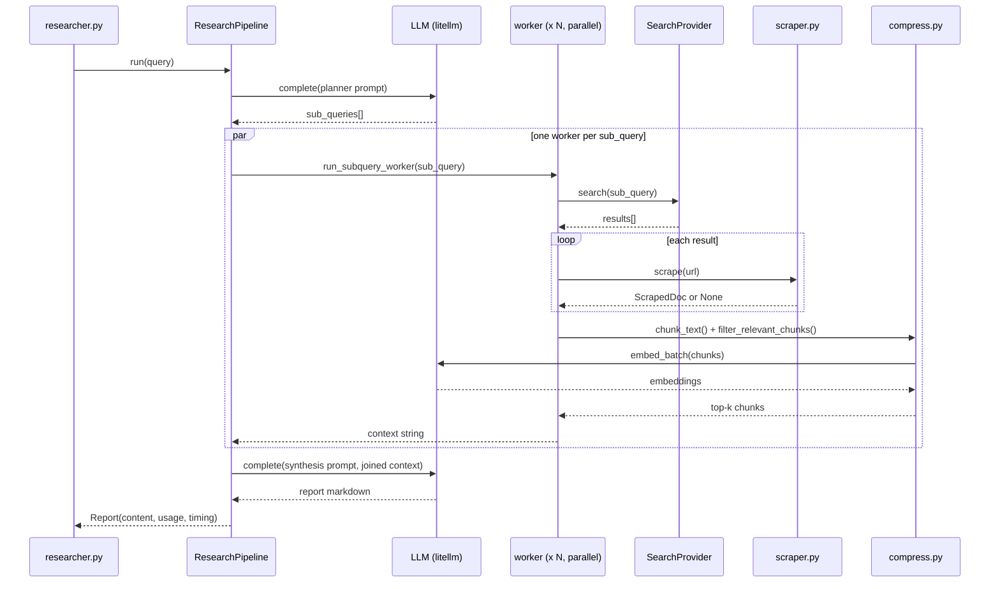
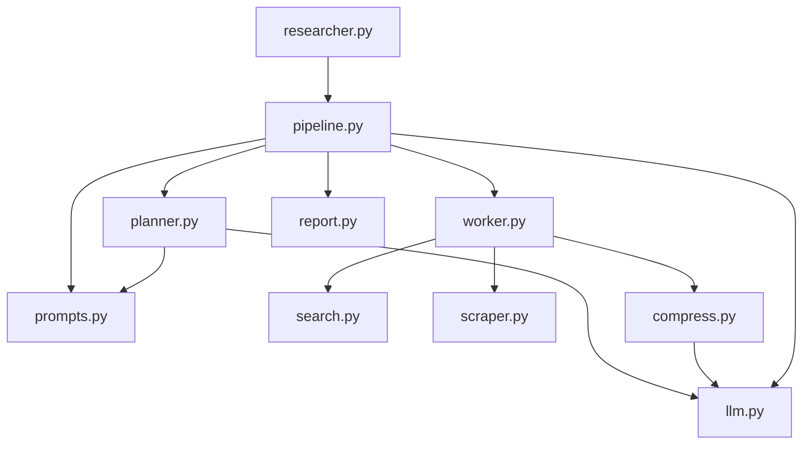
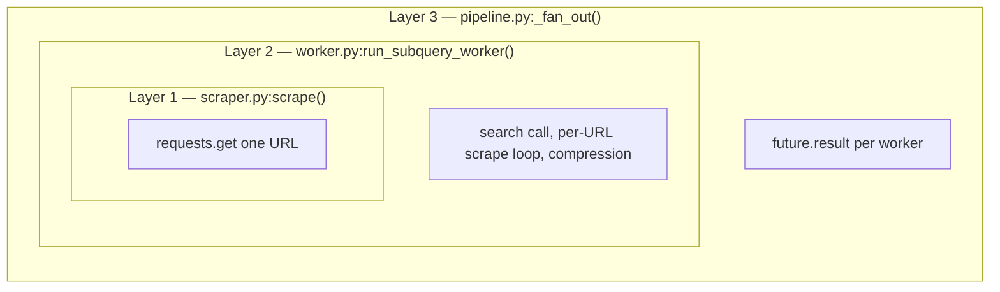

# mini-researcher — Architecture & Design Decisions

> This is the reference document for *how* mini-researcher is built and *why*. `README.md` covers what it does and how to run it. Start with the diagrams below, then read the Design Decisions section for the reasoning behind each structural choice — that way future changes stay consistent with the original reasoning rather than drifting.

---

## 1. At a glance

mini-researcher is one pipeline with four stages: plan, research (in parallel), synthesize, return.

- **Plan** — one LLM call turns the query into a handful of sub-questions.
- **Parallel Research** — each sub-question is searched, scraped, and compressed to relevant chunks, all at the same time.
- **Synthesize** — one LLM call turns the combined research into a cited report (or an honest "not enough information").

That's the whole shape. Everything else in this document is either "how each box actually works" (§2-3) or "why it works that way and not some other way" (Design Decisions, §5+).

---

## 2. Control flow

Expanding "Parallel Research" into what actually happens per sub-query:

Two things worth noticing before the rest of this doc explains why:

- **Exactly two LLM calls surround the fan-out** (planner, synthesizer) — everything model-driven is narrowly scoped to those two structured calls. The fan-out itself is plain code, not a model deciding what to do next (§5).
- **The fan-out is `par`, not sequential** — all N workers run concurrently via `ThreadPoolExecutor`, not `asyncio` (§6).

---

## 3. Component map

One file per concern, no tool registry (§5). `llm.py` is the only module every LLM-touching path shares — it's where cumulative cost tracking lives (§8). Full per-file descriptions are in `README.md`'s project structure section; this diagram is about *dependencies*, not contents.

---

## 4. Scope

**What mini-researcher is:** a scoped-down reimplementation of [gpt-researcher](https://github.com/assafelovic/gpt-researcher)'s core loop, built as a teaching artifact for `agentic-cookbook` — specifically to show that several patterns already taught in isolation elsewhere in the repo (Plan-and-Execute, parallel fan-out/fan-in, context compression via relevance filtering) compose into one coherent, realistic pipeline. No single example in `examples/` demonstrates that composition; mini-researcher does.

**What it is NOT:**

- Not a feature-complete gpt-researcher port — see §12 for what was deliberately cut.
- Not a ReAct agent — there is no LLM-driven tool selection at runtime. The pipeline shape in §1-2 is fixed; only its *inputs* (sub-queries, chunks) vary per run.
- Not stateful across runs — no conversational memory, no persistent index.

The full architecture trace of the *original* gpt-researcher (file/class/function references, concept-ladder mapping) lives at `research/gpt-researcher-architecture.md` in the repo root (gitignored, local-only). This document is about mini-researcher's own design, not a re-summary of that trace.

---

## Design Decisions

The diagrams above show *what* happens. This section is *why* it happens that way — read it before changing any of the pieces in §2-3, so a change stays consistent with the reasoning instead of just the shape.

### 5. Core shape: fixed pipeline, not a ReAct agent

`core/agent.py`'s `Agent` class (used throughout `examples/`) implements a ReAct loop: the model decides which tool to call next, observes the result, and decides again, until it emits a final answer or hits `max_steps`. mini-researcher does not use this — its control flow (§2) is a fixed DAG decided by *code*, not by the model.

**Why:** gpt-researcher itself makes this same choice — its sub-query workers are plain async functions, not agent instances deciding what to do next. The model's job is narrowly scoped to two structured calls (planning, writing), not to orchestrating the pipeline. This is a deliberate illustration that *fan-out/fan-in doesn't require every worker to be a full agent* — sometimes a plain function pipeline is the more honest structure, and reaching for `core/agent.py`'s tool-loop machinery here would add ceremony without adding capability.

**Consequence:** there is no `researcher/tools.py` or tool registry, unlike `theta-agent/tools/`. Each pipeline stage lives in its own file (§3) because each is a distinct *concern*, not because it's a callable tool the model chooses among.

### 6. Concurrency: `ThreadPoolExecutor`, not asyncio

gpt-researcher itself uses `asyncio.gather` for its fan-out. mini-researcher uses `concurrent.futures.ThreadPoolExecutor` instead (`researcher/pipeline.py:_fan_out`).

**Reasoning:**

- Every I/O call in the worker path is synchronous and blocking: `requests.get()` (scraping), `litellm.completion()` (planning/synthesis), `litellm.embedding()` (compression). None of these are async by default in this codebase.
- Following gpt-researcher's asyncio choice faithfully would mean introducing `httpx.AsyncClient` for scraping and `litellm.acompletion()`/`litellm.aembedding()` throughout — a real dependency and design shift, for a workload that's a handful of sub-queries (not hundreds), where the wall-clock benefit of asyncio over threads is negligible.
- This repo has already written down the applicable decision rule, in `examples/03_multi_agent_systems/02_parallel_subagents.md`: match the concurrency primitive to the call stack — sync blocking code uses `ThreadPoolExecutor`, genuinely async code uses `asyncio.gather`. mini-researcher's call stack is sync blocking throughout, so `ThreadPoolExecutor` is the correct choice by that same rule, not just the easier one.
- `examples/03_multi_agent_systems/04_async_announce.py` is not actually an asyncio precedent despite its name — it's `threading.Thread` + `queue.Queue`. There is no real asyncio pattern elsewhere in this repo to stay consistent with.

**Verified:** a 3-sub-query benchmark measured 27.1s sequential vs 8.3s parallel — a 3.3x speedup, in line with what `02_parallel_subagents.py` demonstrates for the same fan-out shape.

**If this changes:** if a future version needs hundreds of concurrent sub-queries (well beyond this tool's teaching scope), asyncio would become the right call — thread pools stop scaling gracefully well before that point. That's a real threshold, not a hypothetical; don't preemptively switch before hitting it.

### 7. Compression: stateless adaptation, not reuse, of `HybridMemoryStore`

`researcher/compress.py`'s `filter_relevant_chunks()` is architecturally the same idea as `examples/02_memory_management/02_hybrid_search.py`'s `HybridMemoryStore.search()`: BM25 keyword scoring + cosine-similarity vector scoring, combined at a 0.3/0.7 weight, normalized, top-k selected.

**Why adapt instead of import:** `HybridMemoryStore` is a *persistent* store — it embeds facts once via `add()`, writes them to a JSON file, and serves many future `search()` calls against that accumulated index. mini-researcher's compression need is different in kind: each sub-query produces its own throwaway batch of scraped chunks, filtered once, then discarded. There's no cross-run reuse and no facts to accumulate — wrapping that in a class with `_load()`/`_save()`/`entries` would be state management for state that doesn't need to persist. `chunk_text()` and `filter_relevant_chunks()` are plain functions instead, because there's nothing to encapsulate.

**One real improvement over the reference implementation:** `HybridMemoryStore._embed()` embeds one string at a time in a loop. mini-researcher's `LLM.embed_batch()` sends the whole chunk list (plus the query) in a single `litellm.embedding()` call. For a sub-query's ~10-30 chunks this is both faster and the more correct idiomatic use of a batchable embeddings API — worth keeping in mind if `HybridMemoryStore` itself is ever revisited.

**Chunking:** `chunk_text()` uses paragraph-aware packing (pack consecutive paragraphs up to `chunk_size`, hard-slice any single paragraph that exceeds it alone) rather than LangChain's `RecursiveCharacterTextSplitter`, which is what gpt-researcher uses. See §9 for why LangChain isn't a dependency here at all.

### 8. Provider abstractions: pluggable via protocol + factory, matching `core/model.py`'s pattern

`researcher/search.py` defines a `SearchProvider` protocol and a `get_search_provider(name)` factory keyed on the `SEARCH_PROVIDER` env var. This deliberately mirrors `core/model.py`'s `provider:model` string convention for LLM selection — swap providers via config, not code changes.

**Search provider choice:** DuckDuckGo (via the `ddgs` package), specifically because it requires **no API key**. theta-agent's optional `search_web` tool needs `BRAVE_API_KEY`; mini-researcher's core loop depends on search for every run, so a zero-setup default matters more here — a first-time user should be able to clone, `uv pip install -e .`, add one LLM key, and get a working report, without also signing up for a search API.

**Scraper choice:** `requests` + `BeautifulSoup4`, extracting `<title>` and joined `
` text. gpt-researcher supports ~8 scraper backends (headless browser for JS-heavy pages, PDF extraction, Firecrawl, etc.); mini-researcher picks the one that's sufficient for a teaching example and adds no browser-automation or paid-API dependency. This means JS-rendered pages and PDFs will fail to scrape (see §11) — an accepted tradeoff, not an oversight.

**Extensibility is the point of this structure**, not a speculative feature: adding a second search provider (e.g. Tavily) later means one new class implementing the same `search()` signature plus one factory branch — zero changes to `worker.py` or `pipeline.py`. This was validated by the `SearchProvider` design during planning, not just asserted.

### 9. Explicitly no LangChain

gpt-researcher depends on LangChain for its text splitter, document types, and some retriever/compressor abstractions. mini-researcher has zero LangChain dependency.

**Why:** `PROJECT_CONTEXT.md`'s stated philosophy for the whole `agentic-cookbook` repo is "Minimalist first — before adding a dependency, ask: can this be done with a standard Python list or function?" `rank_bm25` + `numpy` already substitute for a heavier vector-store dependency in `02_hybrid_search.py`, proving the pattern works without LangChain elsewhere in this repo. Reimplementing chunking as `chunk_text()` (§7) is a few lines of code; pulling in LangChain for it would be a large dependency for a small convenience, and would obscure exactly the mechanism (chunk → embed → filter) this project exists to make visible.

### 10. Why `litellm`, not the `anthropic` SDK directly

theta-agent calls the `anthropic` SDK directly. mini-researcher uses `litellm` instead, via a small local wrapper (`researcher/llm.py`) adapted from — not imported from — `core/model.py`'s `ModelProvider`.

**Why the difference from theta-agent:** mini-researcher needs `litellm.embedding()` in addition to chat completions (for compression, §7); the `anthropic` SDK alone doesn't give you a provider-agnostic embeddings call. `litellm` covers both call types under one dependency, and `ModelProvider`'s cost-tracking pattern (`Usage` accumulator, `litellm.completion_cost()`) is litellm-native — reusing that shape means cost tracking came essentially for free instead of being bolted on later.

**Why adapt `core/model.py` instead of importing it:** `agents/*` projects are deliberately self-contained (own `pyproject.toml`, own venv — see `agents/theta-agent`, which depends on neither `core/` nor `tools/`). Root `core/` isn't published as an installable package; importing it across venvs would mean either a `sys.path` hack or making `agentic-cookbook` a dependency, both of which break the "each agent stands alone" convention this repo has established. `researcher/llm.py` therefore reimplements just the pieces mini-researcher needs (`complete()`, `embed_batch()`, cumulative `Usage`) rather than depending on the root package.

### 11. Failure isolation is layered on purpose

A dead URL, a failed search, or a malformed planner response must never crash the whole run — web research is inherently unreliable at the scale of even a handful of queries. This is enforced at three separate layers, deliberately redundant:

1. **Layer 1 — `scraper.py:scrape()`** never raises: catches `requests.exceptions.RequestException`, checks status code, checks content-type, checks minimum extracted-text length (~200 chars, a cheap heuristic for "this was a JS shell page with no real content"), and returns `None` on any of these rather than propagating.
2. **Layer 2 — `worker.py:run_subquery_worker()`** never raises: wraps the search call in try/except, treats each failed scrape as "skip this URL," and wraps the (rarely-failing but not impossible) compression call with a raw-chunks fallback if embedding fails.
3. **Layer 3 — `pipeline.py:_fan_out()`** wraps every `future.result()` in try/except: even though the two layers below should make this unreachable in practice, one worker's unexpected exception must not take down the other N-1 workers' results or the synthesis step.

Keep all three layers when touching this code path. They're not redundant by accident — each catches a different failure mode, and removing one narrows what a "safe" run means without an obvious signal that it happened.

**Symmetric guard on the output side:** `pipeline.py:_synthesize()` has an explicit abstention instruction (in `prompts/synthesis.md`) for when all workers return empty context — the model is told to say "not enough information" rather than fabricate an answer. Verified directly: a query with deliberately empty context produces an honest "I don't have enough information" response, not a hallucinated one. This is the output-side counterpart to input-side failure isolation — both exist so that partial or total pipeline failure degrades to an honest empty/uncertain answer, never a confident wrong one.

### 12. What was cut, and why

Per the scoping decision made before the build (see `research/gpt-researcher-architecture.md`'s "Scope Recommendation for a Minimal Port"), the following gpt-researcher features are **not** in mini-researcher:

| Cut | Why |
| --- | --- |
| MCP integration | Product surface — a tool-selection/caching layer orthogonal to the core loop this project demonstrates |
| Image generation | Unrelated to the research pipeline |
| `multi_agents/` team mode | A different architecture (agent-per-role) layered on top; the whole point here is the simpler fan-out shape |
| Detailed/subtopic report merging | gpt-researcher's non-default `detailed_report` type does per-subtopic synthesis + merge; the default `research_report` type (what mini-researcher mirrors) is one synthesis call, which is the more instructive baseline |
| Vector-store report sources | An alternate input mode (pre-existing vector DB instead of live search); out of scope |
| Websocket streaming / frontend | Product/UI concern, not a core-loop concept |
| Optional LLM-based source curation | A re-ranking pass on top of embedding-similarity filtering — real but not essential; the embedding+BM25 filter alone is the teaching point |
| 18-provider retriever matrix / 8-backend scraper matrix | One of each is enough to demonstrate the abstraction (§8); more providers are additive, not architecturally different |

None of these are ruled out permanently — `CLAUDE.md`'s increment plan lists a second search provider and source curation as legitimate backlog items if there's ever a concrete teaching reason to add them. The bar for adding any of them back is the same one used to cut them: does it teach a *new* concept, or just add surface area to an existing one?
