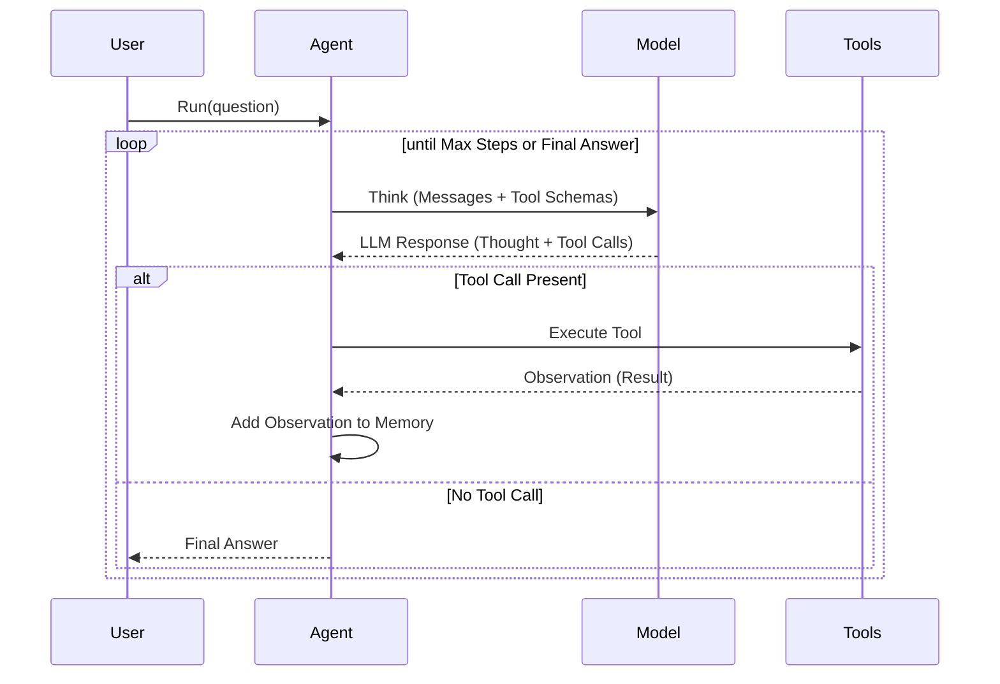

# ReAct Basic Agent Example

This example demonstrates a basic **ReAct** (Reasoning and Acting) agent. The agent can interact with the local file system by listing files and reading their contents.

## Overview

The ReAct pattern allows an LLM to "think" about a problem, "act" by calling a tool, and then "observe" the result of that action before continuing its reasoning. This loop continues until the agent has enough information to provide a final answer.

## Tools Architecture

The system uses a dynamic tool registration system that enables the LLM to understand what tools are available and how to use them.

### Tool Registration
Tools are defined as standard Python functions with type hints and docstrings. The [ToolRegistry](../../core/registry.py) uses Python's `inspect` and `get_type_hints` modules to automatically generate OpenAI-compatible JSON schemas.

```python
def list_files(directory: str = ".") -> str:
    """
    List files and directories in the specified path.
    :param directory: The directory to list.
    """
    # ... implementation ...
```

### Schema Generation
The registry extracts:
1.  **Function Name**: Used as the tool name.
2.  **Docstring**: Used as the tool description.
3.  **Type Hints**: Used to define parameter types (e.g., `str` -> `string`).
4.  **Parameter Descriptions**: Parsed from the `:param name: explanation` format in the docstring.

This schema is passed to the LLM via the `ModelProvider`, allowing the model to know exactly what parameters each tool expects.

### Example: Function to JSON Schema

Given the following tool definition in [tools/system_tools.py](../../tools/system_tools.py):

```python
def list_files(directory: str = ".") -> str:
    """
    List files and directories in the specified path.
    :param directory: The directory to list.
    """
    # ... implementation ...
```

The [ToolRegistry](../../core/registry.py) generates this OpenAI-compatible JSON schema:

```json
{
  "type": "function",
  "function": {
    "name": "list_files",
    "description": "List files and directories in the specified path.",
    "parameters": {
      "type": "object",
      "properties": {
        "directory": {
          "type": "string",
          "description": "The directory to list."
        }
      },
      "required": []
    }
  }
}
```

## Agent Loop Implementation

The core logic resides in the `Agent.run` method in [core/agent.py](../../core/agent.py).

### Execution Flow



### The "Thinking-Acting" Loop

1.  **Think**: The agent sends the conversation history and available tool schemas to the model. The model generates a response that may include a "thought" process and a list of tool calls.
2.  **Observe**: The agent extracts any text content from the response and adds it to its memory.
3.  **Act**: If the model issued tool calls, the agent iterates through them, executes the corresponding functions in the `ToolRegistry`, and captures the output (the "Observation").
4.  **Repeat**: The observation is added back to the memory as a `tool` role message, and the loop starts again. The model now sees its previous thought, the action it took, and the result of that action.

---

### How the Agent Decides and Acts

A common question is: **"How does the agent know which tool to call, and where does the actual calling happen?"**

#### The "Tool Handshake" (Decision Phase)
The agent doesn't "hardcode" the decision. Instead:
1.  **Registry to Schema**: The [ToolRegistry](../../core/registry.py) converts Python functions into JSON schemas.
2.  **Feeding the Model**: In [core/agent.py](../../core/agent.py#L49), these schemas are sent to the model alongside the message history.
3.  **Model Logic**: The LLM compares the user's intent with the tool descriptions. If it finds a match, it returns a structured **Tool Call** object (e.g., `{"name": "read_file_content", "arguments": "{\"file_path\": \"README.md\"}"}`).

#### The Execution Phase (Acting)
The actual Python function invocation does not happen inside the LLM or the `ModelProvider`. It happens within the `Agent.run` loop:
- **Location**: [core/agent.py:L79](../../core/agent.py#L79)
- **Code**: `result = self.registry.call_tool(tool_name, tool_args, context=self)`
- **Mechanism**: The agent extracts the name and arguments from the model's response and passes them back to the `ToolRegistry`, which then executes the corresponding Python function.

---

### Advanced: Arguments and Context Injection

The `ToolRegistry` distinguishes between **LLM arguments** and **System context**:

1.  **Arguments (LLM-Provided)**: These are the parameters defined in your tool's signature and shared with the model via the JSON schema. The model is responsible for filling these in.
2.  **Context (System-Provided)**: If a tool function includes a `context` parameter, the registry automatically injects the **Agent instance** itself into the call. 
    - This parameter is **not** included in the JSON schema, so the LLM remains unaware of it.
    - It allows tools to interact with the agent's memory, state, or other internal components.

> [!TIP]
> **Why use context?** This pattern allows tools to perform "meta-tasks" like searching the agent's own conversation history or coordinating with other agents, all without cluttering the prompt or exposing internal Python objects to the LLM.

## Implementation Details

### Available Tools in this Example
In [examples/01_agent_patterns/01_react_basic.py](../../examples/01_agent_patterns/01_react_basic.py), two tools are registered:
- `list_files`: Lists contents of a directory.
- `read_file_content`: Reads the contents of a specific file.

### Agent Loop Snippet
```python
while steps < self.max_steps:
    # 1. Think (Model Generation)
    response = self.model.generate(
        messages=self.memory.get_messages(),
        tools=self.registry.get_schemas()
    )

    # 2. Observe (Handle Content)
    if response.content:
        self.memory.add_message("assistant", response.content)

    # 3. Act (Tool Execution)
    if response.tool_calls:
        for tool_call in response.tool_calls:
            # Execute tool from registry
            result = self.registry.call_tool(
                tool_call.name, 
                tool_call.arguments, 
                context=self
            )
            # Add observation to memory
            self.memory.add_message(
                "tool", 
                str(result), 
                tool_call_id=tool_call.id,
                name=tool_call.name
            )
        continue # Cycle back to 'Think'
    else:
        break # No more actions needed
```

## Running the Example
To run this example, ensure you have your environment variables set up in `.env` and run:

```bash
python examples/01_agent_patterns/01_react_basic.py
```
