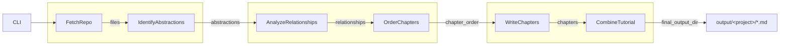
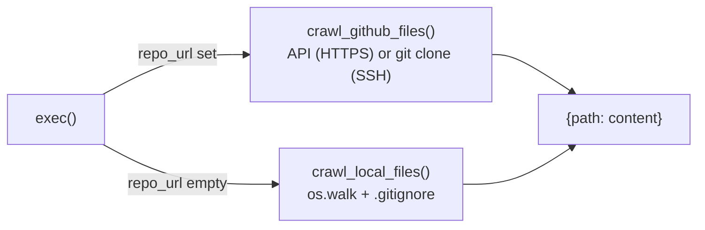
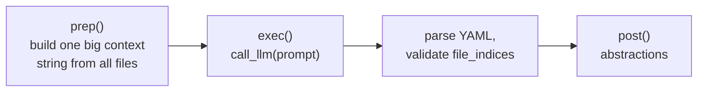
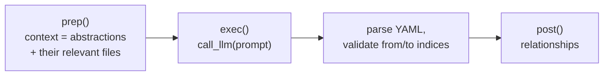
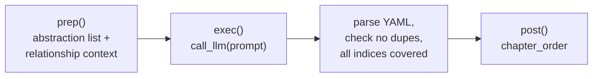
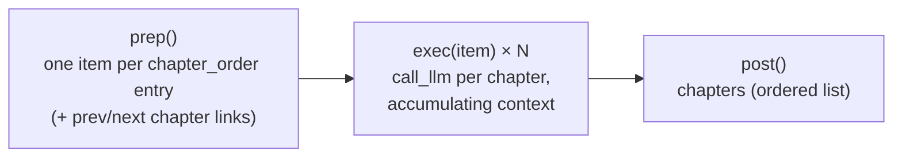
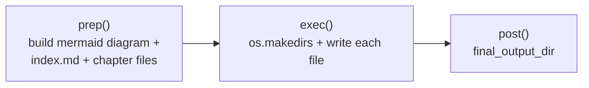

# PocketFlow tutorial pipeline: node chain + I/O

Analysis of [`The-Pocket/PocketFlow-Tutorial-Codebase-Knowledge`](https://github.com/The-Pocket/PocketFlow-Tutorial-Codebase-Knowledge) (a reference tool that auto-generates a codebase tutorial). Studied as an example of a PocketFlow pipeline.

Six PocketFlow nodes, wired in a straight line (`flow.py`). Every node reads its
inputs from a single shared dict and writes its output back into the same dict under
a new key — that shared dict is the only thing connecting them.



See "Node deep dives" below for the mermaid diagram + exact `shared[...]` input/output
format of each node.

## The pattern

Every node follows the same shape:

```python
class SomeNode(Node):
    def prep(self, shared):   # read inputs from shared dict
        ...
    def exec(self, prep_res): # do the work (LLM call, crawl, file write, ...)
        ...
    def post(self, shared, prep_res, exec_res):
        shared["some_key"] = exec_res   # write output back for the next node
```

Nothing is passed node-to-node directly — `shared` is the only channel. This is what
makes the wiring in `flow.py` trivial:

```python
fetch_repo >> identify_abstractions >> analyze_relationships >> order_chapters >> write_chapters >> combine_tutorial
```

Each `>>` just declares "run this next"; the actual data handoff already happened
through `shared`.

## Node deep dives

Each node below follows the same read-from-`shared` / do-the-work / write-back-to-`shared`
shape — the diagrams show what actually happens inside `exec`.

### `FetchRepo`

Doesn't crawl itself — dispatches to one of two interchangeable helpers based on
which CLI flag was used, both returning the same `{path: content}` shape.



```
in:  shared["repo_url"]:  str | None
     shared["local_dir"]: str | None
     shared["include_patterns"]: set[str]   # e.g. {"*.py", "*.md"}
     shared["exclude_patterns"]: set[str]   # e.g. {"*tests/*"}
     shared["max_file_size"]: int           # bytes

out: shared["files"]: list[tuple[str, str]]   # [(path, content), ...]
```

Both apply the same include/exclude glob filter and size cap; GitHub additionally
resolves branch/commit refs and handles rate limits, local additionally respects
`.gitignore`.

### `IdentifyAbstractions`

Dumps every file into one prompt, asks the LLM for the project's core concepts, then
validates the YAML it gets back (indices in range, required keys present) before
storing it.

> **Important:** "abstraction" here isn't the programming-language sense (interface,
> base class, etc.) — it's the LLM's own answer to "what are the core concepts a
> newcomer needs to understand this codebase?" Each one is
> `{"name": str, "description": str, "files": [file_idx, ...]}`, and could end up being
> a class, a module, a subsystem, or a cross-cutting idea — whatever the LLM judges is
> coherent enough to teach as one unit. Everything downstream treats an abstraction as
> a chapter candidate: `AnalyzeRelationships` connects them, `OrderChapters` sequences
> them, `WriteChapters` turns each one into an actual chapter. So in this pipeline,
> **abstraction ≈ one chapter's worth of concept.**



```
in:  shared["files"]:        list[tuple[str, str]]    # [(path, content), ...]
     shared["project_name"]: str

out: shared["abstractions"]: list[dict]
     # [{"name": str, "description": str, "files": list[int]}, ...]
```

```python
item["files"] = sorted(set(validated_indices))  # dedupe + sanity-check indices
```

Prompt template: [`nodes.py:140`](https://github.com/The-Pocket/PocketFlow-Tutorial-Codebase-Knowledge/blob/05b24cbbb0fe409c5e23c9791f0342f07524ffdc/nodes.py#L140).

### `AnalyzeRelationships`

Takes the abstractions from step 2 plus only the files they reference (not the whole
repo again), and asks the LLM for a project summary + a graph of how the
abstractions interact.



```
in:  shared["abstractions"]: list[dict]                # from IdentifyAbstractions
     shared["files"]:        list[tuple[str, str]]

out: shared["relationships"]: dict
     # {"summary": str, "details": [{"from": int, "to": int, "label": str}, ...]}
```

```python
# every abstraction must appear in at least one relationship — enforced in the prompt, not code
```

Prompt template: [`nodes.py:309`](https://github.com/The-Pocket/PocketFlow-Tutorial-Codebase-Knowledge/blob/05b24cbbb0fe409c5e23c9791f0342f07524ffdc/nodes.py#L309).

### `OrderChapters`

Given the abstractions and their relationships, asks the LLM to pick a teaching
order (foundational/user-facing concepts first, implementation details later).



```
in:  shared["abstractions"]:  list[dict]
     shared["relationships"]: dict

out: shared["chapter_order"]: list[int]   # abstraction indices, one full permutation
```

```python
if len(ordered_indices) != num_abstractions:
    raise ValueError("...missing indices...")   # LLM must return every abstraction, exactly once
```

Prompt template: [`nodes.py:466`](https://github.com/The-Pocket/PocketFlow-Tutorial-Codebase-Knowledge/blob/05b24cbbb0fe409c5e23c9791f0342f07524ffdc/nodes.py#L466).

### `WriteChapters` (a `BatchNode`)

The one node that isn't a single prep→exec→post call — it's prep→(exec × N)→post,
one `exec` per chapter. The chapters are written in order because each `exec` call
appends to `self.chapters_written_so_far` and feeds that running summary into the
*next* chapter's prompt, so later chapters can reference earlier ones.



```
in:  shared["chapter_order"]: list[int]
     shared["abstractions"]:  list[dict]
     shared["files"]:         list[tuple[str, str]]

out: shared["chapters"]: list[str]   # Markdown per chapter, same order as chapter_order
```

```python
self.chapters_written_so_far.append(chapter_content)  # feeds the *next* exec() call's prompt
```

Prompt template: [`nodes.py:678`](https://github.com/The-Pocket/PocketFlow-Tutorial-Codebase-Knowledge/blob/05b24cbbb0fe409c5e23c9791f0342f07524ffdc/nodes.py#L678) (`previous_chapters_summary` inside it is the running
join of every chapter written so far in this batch — that's what makes chapter N aware
of chapters 1..N-1 despite `WriteChapters` being a batch of otherwise-independent `exec` calls).

### `CombineTutorial`

No LLM call — pure assembly. Builds a Mermaid relationship diagram from
`relationships["details"]`, writes an `index.md`, and writes one `.md` file per chapter.



```
in:  shared["chapters"]:      list[str]
     shared["chapter_order"]: list[int]
     shared["abstractions"]:  list[dict]
     shared["relationships"]: dict

out: shared["final_output_dir"]: str   # e.g. "output/<project_name>"
```

```python
mermaid_lines.append(f'    {from_node_id} -- "{edge_label}" --> {to_node_id}')  # relationships → diagram edges
```
